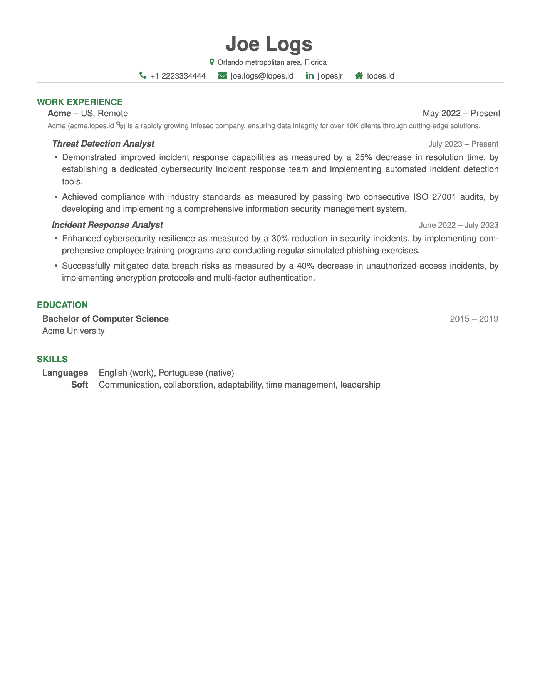

# Worklogs
Worklogs is a minimalist résumé and template in LaTeX with focus in work experience.  The template is accompanied by a cover letter template in the same style, which can be used optionally.




## Usage
This project was built upon `pdfLaTeX` and I **strongly** recommend you to use [Overleaf](https://www.overleaf.com/) to edit and compile it.  If you want to run it locally, the commands below should work.  

```sh
git clone git@github.com:lopes/worklogs.git
cd worklogs
pdflatex main.tex
```


## Customization
I've built some features to allow anyone to easily fit the template to their needs.  This template uses the [fontawesome package](https://ctan.org/pkg/fontawesome?lang=en), allowing you to add fancy icons with commands like `\faIconName`.

### Colors
Worklogs uses three base colors and you can configure them by changing the hexadecimal codes in:

```tex
\definecolor{base}{HTML}{545454}
\definecolor{light}{HTML}{808080}
\definecolor{accent}{HTML}{008744}
```

### Header and Sections
The header is built with the `\header` command and it takes one parameter per information shown: Name, location, phone number, e-mail address, LinkedIn handler, and personal domain.  Example:

```tex
\header
 {Joe Logs}
 {Orlando metropolitan area, Florida}
 {+1 2223334444}
 {joe.logs@lopes.id}
 {jlopesjr}
 {lopes.id}
```

New sections can be added with the `\section` command that takes one parameter for the section name.

### Organizations, Roles and Highlights
Your work experience will be grouped by the organizations you was part of, the roles you assumed, and the highlights for each of them.  Here's a brief description of them: 
- `\organization`: Name, your contract's location, start date, end date, description (brief description of the organization, optional for well-known companies).
- `\role`: Name, start date, end date.
- `\highlight`: Description of the highlight, must be placed inside the `highlights` environment.

Example:

```tex
\organization
 {Acme}
 {US, Remote}
 {May 2022}
 {Present}
 {Acme (acme.lopes.id) is a rapidly growing Infosec company, ensuring data ...}
\role{Threat Detection Analyst}{July 2023}{Present}
\begin{highlights}
 \highlight{Demonstrated improved incident response capabilities as measured by a 25\% ...}
 \highlight{Achieved compliance with industry standards as measured by passing two ...}
\end{highlights}
\role{Incident Response Analyst}{June 2022}{July 2023}
\begin{highlights}
 \highlight{Enhanced cybersecurity resilience as measured by a 30\% reduction ...}
 \highlight{Successfully mitigated data breach risks as measured by a 40\% ...}
\end{highlights}
```

### Education
The `\education` command takes 4 parameters: Course name, start date, end date, and institution.

```tex
\education
 {Bachelor of Computer Science}
 {2015}
 {2019}
 {Acme University}
```

### Skills
The `\skills` command creates a new environment for you to add skills with the `\skill` command, which takes two parameters: The group name and the skills list.  Example:

```tex
\begin{skills}
\skill
 {Languages}
 {English (work), Portuguese (native)}
\skill
 {Soft}
 {Communication, collaboration, adaptability, time management, leadership}
\end{skills}
```


## Cover Letter
The cover letter template follows the same style from the résumé: Minimalist, same font face (Helvetica), and same color palette.  This template has three major blocks: Sender, letter header, and signature.

The sender section is placed in the left column and is built with the `\sender` command, which receives the sender's Name, position, address, phone number, and email address.  Example:

```tex
\sender
 {Joe Logs}
 {Threat Detection\\Analyst}
 {Orlando, FL\\US}
 {+1 2223334444}
 {joe.logs@lopes.id}
```

The letter header is built with the `\letterheader` gets more parameters, related to the date and receipt basically: Date, receipt's name, receipt's organization, receipt's address, and salutation.  Example:

```tex
\letterhead
 {23 December 2023}
 {Dennis Ritchie}
 {Bell Laboratories}
 {600 Mountain Avenue\\Murray Hill, NJ 07974-0636}
 {Mr. Ritchie}
```

Finally, the signature section is built with the `\signature command` that gets two parameters, being the first optional: valediction (if omitted, the word `sincerely` will be used) and the sender's name.  An example is: `\signature{}{Joe Logs}`.

## License
Distributed under the MIT License. See `LICENSE` for more information.
